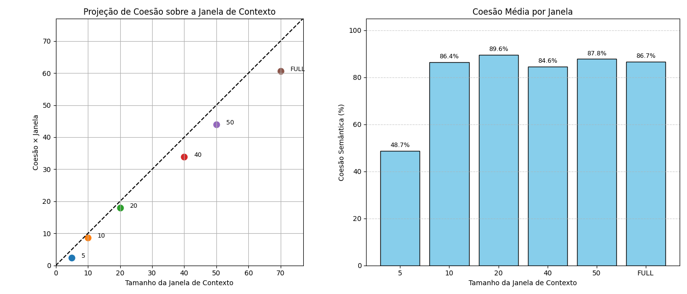

# Word Embedding

## Overall Project Objective

Empirically explore how the **lexical context-window size**—and other graph-construction parameters—affect document segmentation obtained with **Bayesian Stochastic Block Models (SBM)**.
In addition, evaluate whether semantic embeddings produced by **Word2Vec** (CBOW/Skip-gram) and **clustered with K-Means** can **complement or explain** those structural partitions.

Current status: the work has focused on code prototyping, controlled runs, and comparative metric analysis (VI, NMI, cohesion), laying the groundwork for future integration into the Sashimi interface.

---

## Timeline & Progress

| Phase                                                     | Period             | Key deliverables                                                                                                                                                                |
| --------------------------------------------------------- | ------------------ | ------------------------------------------------------------------------------------------------------------------------------------------------------------------------------- |
| **1 – Baseline**                                          | First presentation | • Document–Term graph (spaCy + graph-tool)<br>• Initial SBM application<br>• Performance tweaks (dictionary lookup, `tqdm`)                                                     |
| **2 – Refinement with `main.py`**                         | Mid-project        | • Full pipeline in **`main.py`**<br>• Word2Vec hyper-parameter search<br>• Evaluation metrics (VI, NMI, Purity)<br>• Intermediate graphs Doc–Cluster–Term and Community–Cluster |
| **3 – Context-window analysis (`window_experiments.py`)** | Final stage        | • Tripartite Doc–Window–Term graph<br>• Sweep over windows 5 / 10 / 20 / 40 / 50 / FULL<br>• SBM × Word2Vec comparison for each window<br>• Result exports and cohesion plot    |

---

## Theoretical Foundations & Usage Guidelines

### Motivation

SBM exploits **relational structure** derived from co-occurrence graphs built from document-window-term relationships, whereas Word2Vec captures **distributed semantics** from word co-occurrences. Each method excels in different scenarios; combining them offers the best of both worlds.

### Conceptual Comparison

**Representation & Assumptions**

* **SBM** – models link probabilities between vertices based on latent blocks, capturing structural communities.
* **Word2Vec + K-Means** – projects terms/documents into a vector space where proximity reflects semantics; K-Means assumes spherical clusters.

**Strengths**

| Approach               | Strengths                                                                                                                                                     |
| ---------------------- | ------------------------------------------------------------------------------------------------------------------------------------------------------------- |
| **SBM**                | • Robust to textual noise when the graph is informative<br>• Variants (degree-corrected, nested, overlapping) adapt to heterogeneity and multilayer structure |
| **Word2Vec + K-Means** | • Linear scalability with corpus size<br>• Captures synonymy and analogies beyond purely structural models                                                    |

**Limitations**

| Approach               | Bottlenecks                                                                           |
| ---------------------- | ------------------------------------------------------------------------------------- |
| **SBM**                | Needs a reasonably dense graph; ignores latent semantic similarity absent in topology |
| **Word2Vec + K-Means** | Requires *k* a priori; assumes convexity; loses explicit link information             |

**When to use each approach?**

* **Corpora with strong citation / collaboration structure** → **SBM** usually explains practice communities better.
* **Short corpora or lacking link metadata** → **Word2Vec** captures synonymy and local context.
* **Link-prediction tasks** → **SBM** yields probabilities for future edges.

<!-- ---

## Main Scripts

### `main.py` (Phase 2)

1. **Bipartite** Document-Term construction
2. **SBM** on the weighted graph
3. **Word2Vec + K-Means** with optional hyper-parameter tuning
4. **Structural comparisons** (VI, NMI) and **Cluster Purity**
5. **Visualisations**: SBM blocks, clusters, heatmaps, Doc–Cluster graphs

### `window_experiments.py` (Phase 3)

1. **Tripartite** Doc–Window–Term graph; window = *w* tokens (or `full`)
2. **SBM** on the Doc–Window subgraph for local semantic blocks
3. **Word2Vec + K-Means** on the Doc–Term subgraph
4. **Metrics per window**: blocks / clusters, VI, NMI, mean cohesion
5. **Reports** saved in `outputs/window` (CSV, PDF, PNG) -->

---

## Comparative Metrics — VI, NMI & Cohesion

| Metric                                           | What it measures                            | Interpretation                           | Why it matters here                                                                                                                                       |
| ------------------------------------------------ | ------------------------------------------- | ---------------------------------------- | --------------------------------------------------------------------------------------------------------------------------------------------------------- |
| **VI – Variation of Information**                | Information distance between two partitions | 0 = identical; higher ⇒ more divergence  | Quantifies structural deviation between SBM communities and semantic clusters; helps choose the window that **minimises** structure × semantics mismatch. |
| **NMI – Normalised Mutual Information**          | Shared information (0–1)                    | 1 = identical; 0 = independent           | Intuitive scale; allows comparison across windows with different block counts; confirms whether VI reduction reflects genuine similarity.                 |
| **Semantic cohesion** (mean Word2Vec similarity) | Intra-cluster compactness                   | Higher ⇒ **semantically tight** clusters | Ensures that VI↓ / NMI↑ are **not** achieved by lumping semantically distant terms; quality control inside clusters.                                      |

Combined reading: **VI ↓ & NMI ↑** → good overlap between SBM and Word2Vec; **Cohesion ↑** → overlap preserves internal semantic density.

---

## Execution Flow — `window_experiments.py`

| #     | Block                               | Purpose                                                        |
| ----- | ----------------------------------- | -------------------------------------------------------------- |
| **0** | `main()`                            | Loops over windows \[5, 10, 20, 40, 50, "full"]; starts timer. |
| **1** | `run_pipeline()`                    | Runs full pipeline for each window.                            |
| 1.1   | `initialize_graph()`                | Empty graph with properties.                                   |
| 1.2   | `build_window_graph()`              | Tripartite Doc–Window–Term construction.                       |
| 1.3   | `extract_doc_jan_graph()`           | Bipartite Doc–Window for SBM.                                  |
| 1.4   | `extract_doc_term_graph()`          | Bipartite Doc–Term for Word2Vec + K-Means.                     |
| 1.5   | `min_sbm_docs_janelas()`            | Applies SBM on Doc–Window.                                     |
| 1.6   | `count_jan_blocks()`                | Number of window-blocks → *k* for K-Means.                     |
| 1.7   | `train_word2vec()`                  | Trains Word2Vec with window =*w*.                              |
| 1.8   | `cluster_terms()`                   | K-Means clustering of embeddings.                              |
| 1.9   | `semantic_cohesion()`               | Mean intra-cluster similarity.                                 |
| 1.10  | `cluster_analyse()`                 | Prints DataFrame, optional CSV.                                |
| 1.11  | `compare_clusters_sbm()`            | Detailed cluster × SBM comparison.                             |
| 1.12  | `compare_partitions_sbm_word2vec()` | Computes VI, NMI, overlap.                                     |
| 1.13  | Return dict                         | `{window, blocks, clusters, VI, NMI, mean_cohesion}`.          |
| **2** | Post-loop                           | Concatenate to `results_window.csv`; plot cohesion curve.      |
| **3** | Final output                        | Table summary + runtime.                                       |

**Run**

```
python3 window_experiments.py
```

---

### Example Result — For Illustration Only

The following table summarizes metric values for a typical run across several context-window sizes. This example is included **solely to demonstrate the limited correlation between SBM blocks and Word2Vec clusters**:

| Window | SBM Blocks | W2V Clusters | VI ↓     | NMI ↑     | Mean Cohesion ↑ |
| ------ | ---------- | ------------ | -------- | --------- | --------------- |
| 5      | 244        | 244          | 5.83     | 0.059     | 0.48            |
| 10     | 264        | 264          | 5.79     | 0.063     | 0.85            |
| **20** | **296**    | **296**      | **5.71** | **0.065** | 0.90            |
| 40     | 278        | 278          | 5.76     | 0.063     | **0.91**        |
| 50     | 267        | 267          | 5.80     | 0.061     | 0.85            |
| FULL   | 87         | 87           | 6.24     | 0.048     | 0.88            |



### Observations

* **20 tokens** achieves the best alignment (lowest VI, highest NMI).
* **Cohesion** peaks at *w* = 40 but structural gains plateau.
* **FULL** window loses local granularity → fewer blocks/clusters, NMI↓, VI↑.

## Conclusion — SBM vs Word2Vec + K-Means Alignment

This project aimed to evaluate how well semantic clusters generated by **Word2Vec + K-Means** align with structural communities inferred by **Stochastic Block Models (SBM)** applied to document-term graphs.

### Summary of empirical findings:

- **Variation of Information (VI)** remained high (5.7–6.2) across all context window sizes;
- **Normalized Mutual Information (NMI)** was consistently low (0.048–0.065), indicating **weak overlap between groupings**;
- Meanwhile, **semantic cohesion** of Word2Vec clusters was consistently high (0.85–0.91), especially for window sizes between 20 and 40 tokens.

These results suggest that **SBM and Word2Vec cluster based on fundamentally different principles**: SBM captures **structural patterns of connectivity** in the graph, while Word2Vec encodes **semantic similarity** from co-occurrence in text. The methods are not redundant; they complement each other.


### Implications and Future Directions

This divergence between semantic and structural clusters **should not be viewed as a failure**, but rather as an opportunity to explore new directions:

1. **Complementarity**  
   SBM reveals latent structural blocks (e.g., topical or functional communities), while Word2Vec captures semantic neighborhoods. Using both together can enrich document representations.

2. **Attribute-aware modeling**  
   Future work can incorporate Word2Vec embeddings as vertex attributes in **attribute-aware SBMs**, or explore **multiplex models** combining semantic and structural layers.

3. **Interpretability through divergence**  
   Regions where SBM and Word2Vec disagree may correspond to ambiguous terms, interdisciplinary areas, or concept drift — offering useful targets for interpretation or human-in-the-loop refinement.

4. **Interactive alignment**  
   Divergence between methods could be leveraged in systems where users guide model alignment based on their analytical goals (e.g., topic discovery, summarization, visualization).

### Final Remark

Rather than forcing convergence between SBM and Word2Vec, this project shows that **the contrast itself is informative**. Each model offers a unique lens: SBM reveals how terms and documents connect structurally; Word2Vec reveals how they relate semantically. Their combination provides a richer and more nuanced map of the corpus.